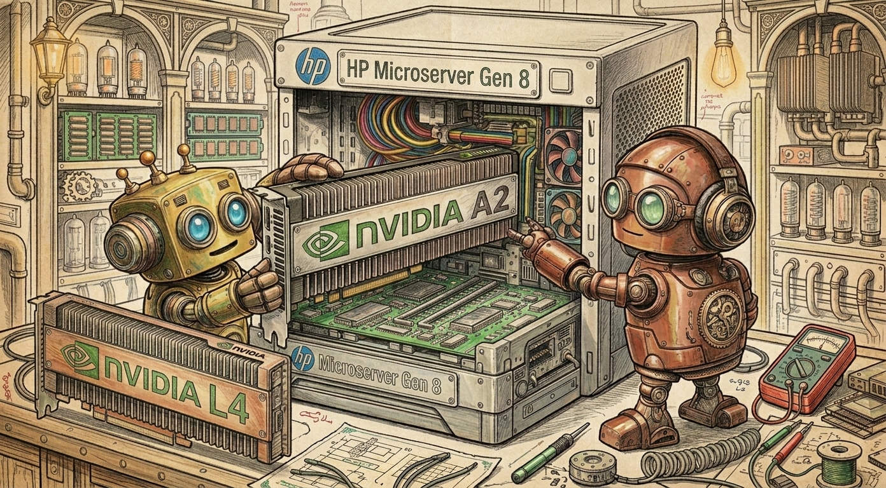
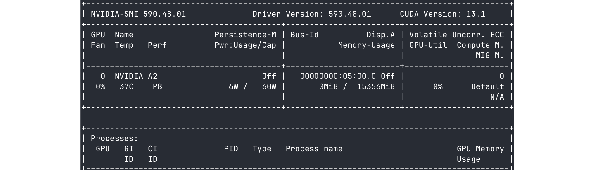
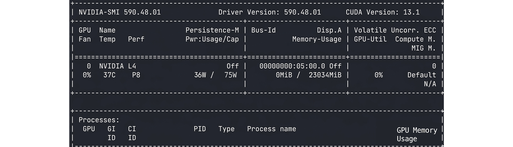
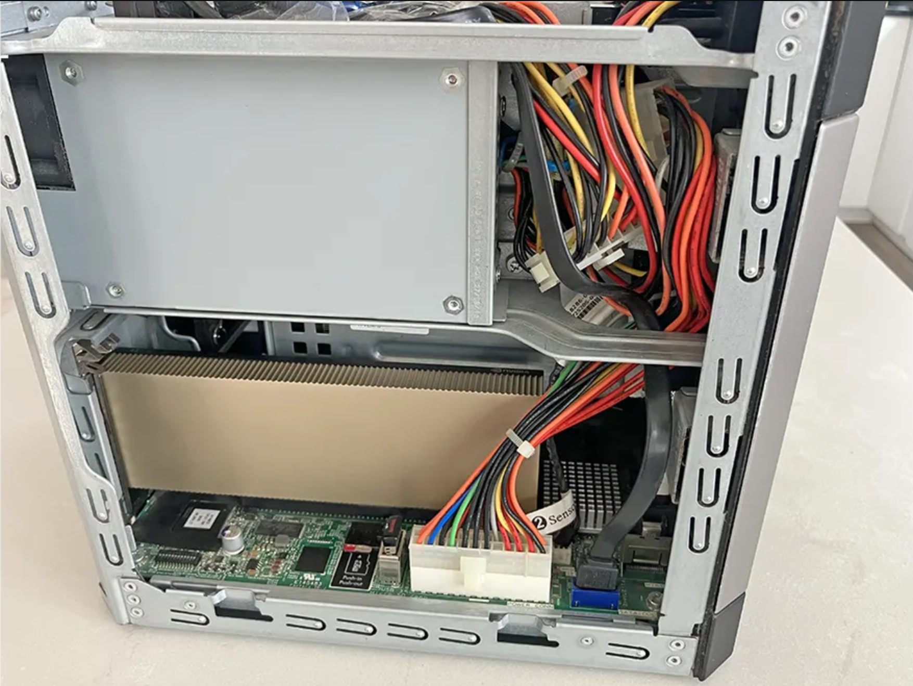
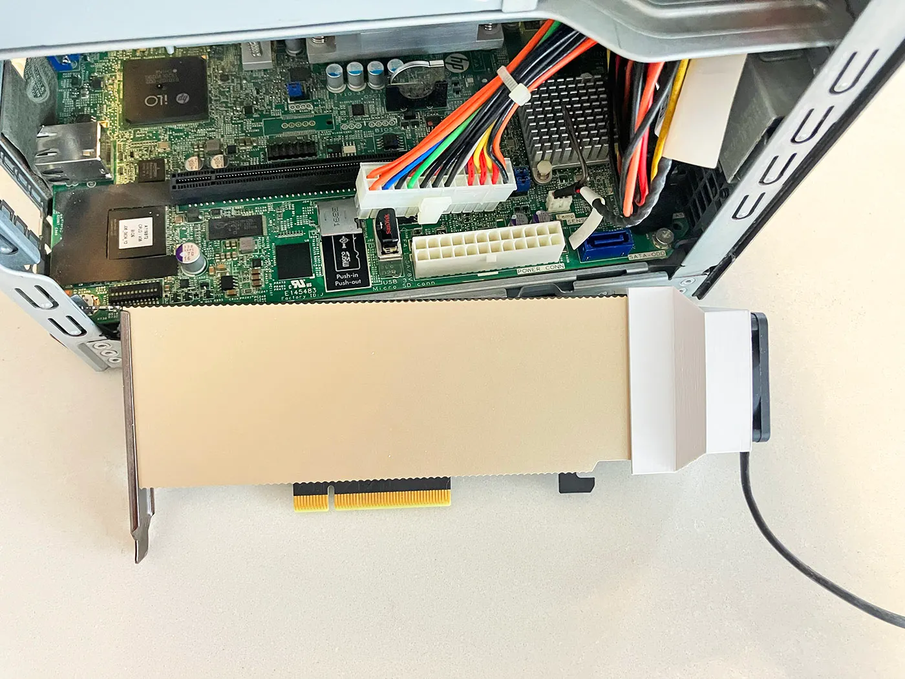

*How an NVIDIA Tesla A2 and L4 Found a Home in HP Microserver Gen8 that Shouldn't Support Them*



## Outline

1. Two Worlds Apart
2. The BAR Wall
3. The Chicken-and-Egg Problem
4. The Breakthrough
5. The Recipe
6. Can Gen8 handle GPU Temperature
7. Epilogue

---

## 1. Two Worlds Apart

This is a story about two pieces of hardware that were never supposed to meet.

On one side is the **HP MicroServer Gen8**, a compact 8×8-inch server from 2012 that still has a devoted following thanks to its flexibility, elegant design, and tiny footprint. It shipped with Intel's Ivy Bridge architecture, a C204 chipset, and a PCIe slot that was perfectly adequate for its era. It was built for small offices and tinkerers, a humble workhorse designed to serve files, run a few VMs, and not cause trouble.

The conventional wisdom repeated across forums, Reddit threads, and even by AI assistants was that these GPUs are fundamentally incompatible with the Gen8. The PCIe root port provides a 24GB prefetchable window. The A2 wants 48GB. The L4, with its larger VRAM, likely wants even more. The math doesn't work. The usual advice was simple: stick with something like a low-profile GTX 1050. End of story.

Except it wasn't.

## 2. The BAR Wall

To understand why everyone, including Claude, ChatGPT said this was impossible, we need to see what PCIe BARs are and why they matter.

Every PCIe device needs address space windows into system memory where the CPU and device can talk. These are called **Base Address Registers (BARs)**. They are reserved parking spots in your computer's memory map. The A2 needs two enormous spots:

```
BAR1: 16GB (0x400000000) - the main memory window for VRAM
BAR8: 32GB (0x800000000) - a prefetchable region for GPU operations
Total: ~48GB of 64-bit prefetchable address space
```

The L4, with 24GB of VRAM, likely requires an even larger BAR1 window, potentially 32GB or more making the theoretical mismatch with the Gen8's 24GB PCIe window even worse on paper.

The Gen8's PCIe root port at 00:01.0 offers a 24GB prefetchable window, spanning from 0x600000000 to 0xBFFFFFFFF. For GPUs that want 48GB or more, the math simply doesn't add up.

When Linux tries to assign the BARs, it does the math and throws its hands up saying no compatible bridge window.

```
BAR 1: no space for [mem size 0x400000000 64bit pref]
BAR 8: no space for [mem size 0x800000000 64bit pref]
```

NVRM: BAR1 is 0M @ 0x0 .. This PCI I/O region assigned to your NVIDIA device is invalid.

That last line is the death sentence. BAR1 at zero means the GPU has no memory window. No memory window means the driver can't initialize. No initialization means the GPU is a very expensive silent paperweight.

## 3. The Chicken-and-Egg Problem

Now, the natural instinct for a home lab enthusiast is: "I'll pass it through to a VM. Maybe the VM can sort it out." This is where things become tricky.

VFIO passthrough is the mechanism that lets a VM directly access a physical PCIe device and works by binding the device to the **vfio-pci** driver at boot, before any other driver touches it. That's the whole idea that the device is kept pristine and untouched for the VM to claim.

But pristine and untouched is exactly the problem. VFIO grabs the GPU before any NVIDIA driver can initialize the BAR space. The BAR registers stay at zero. The VM receives a device with BAR1 = 0M. The NVIDIA driver inside the VM sees the same invalid memory window and refuses to start.

It's a perfect trap. Passthrough requires VFIO, but VFIO prevents BAR initialization, and without BAR initialization, the passed-through GPU is useless. This applies equally to the A2 and the L4.

## 4. The Breakthrough

The solution, discovered in February 2026 with the A2 and L4, is beautifully counter-intuitive. Thankfully discovered before my attempts to go into low-level BIOS patching that would have probably never worked and might have bricked my old server.

Instead of binding the GPU to VFIO at boot, just let the **NVIDIA open-source kernel driver** initialize it first. Yes, on the host. On the very host you're eventually going to take the GPU away from.

**The reason it works is surprisingly elegant:**

The NVIDIA open-source driver (nvidia-open) performs a sophisticated initialization sequence. Unlike a raw VFIO bind, it negotiates with the hardware about what memory mapping is actually needed for functionality versus the theoretical maximum. The driver writes working BAR values into the GPU's PCIe configuration registers that fit within the Gen8's 24GB window.

Those PCIe configuration registers are hardware registers. They persist. When you later unbind the NVIDIA driver and bind VFIO instead, VFIO doesn't clear them. It just takes ownership of a device whose BARs are already correctly configured.

The VM's NVIDIA driver then reads the already-correct values and initializes perfectly. Host NVIDIA driver initializes BAR space → VFIO binds without clearing it → VM reads correct values → Full GPU in the VM

This was proven with the A2 and L4 and the same nvidia-open driver family. Since the open driver supports both architectures and the BAR negotiation mechanism is the same. The L4's 72W TDP is within the Gen8's PCIe slot power budget, and it requires no additional power connector just like the A2.

The GPU doesn't always need the full window mapped to function. During driver initialization, there's a negotiation between driver and hardware about what's actually required for operation versus what's advertised.

```
BOOT 1
Host:
NVIDIA driver initializes BARs

BOOT 2
VFIO binds GPU
BAR configuration persists

VM START
Guest driver reads valid BAR configuration
GPU works
```

## 5. The Recipe

Enough theory. Let's build it. Here is the exact sequence that produces a working NVIDIA A2 and L4 inside a Linux VM on the HP MicroServer Gen8 running Unraid.

### Prerequisites

Before we touch any configuration, make sure you have:

- Unraid 7.x with Community Applications plugin installed
- Your NVIDIA GPU (A2 or L4) physically seated in the Gen8's lone PCIe x16 slot
- BIOS version J06 (the latest; press F9 during POST to check)
- No additional power connectors are required. However, upgrading the PSU to the 250W version is recommended. The A2 draws 60W and the L4 draws 72W, both within the PCIe slot's 75W budget

### BIOS Settings

In the Gen8 BIOS (F9 during POST), verify:

```
Virtualization Technology (VT-x): ENABLED
VT-d (Directed I/O): ENABLED
IOMMU: ENABLED (may appear as Intel VT-d)
```

### Configure Linux Boot Parameters

Set the append line to:

```bash
kernel /bzimage
append pcie_acs_override=downstream vfio_iommu_type1.allow_unsafe_interrupts=1 intel_iommu=relax_rmrr video=efifb:off pci=realloc=on pci=nocrs initrd=/bzroot
```

### Install the NVIDIA Open Source Driver on the Host

**This is the step that makes it possible. Unraid was used but you can use Proxmox, TrueNAS, Ubuntu, Fedora, etc.**

1. In the Unraid GUI → Apps
2. Search for "Nvidia Driver"
3. Install the NVIDIA Driver plugin
4. Select: Open Source Driver v570.86.16 (or latest open source version)
5. Click Apply and reboot

You MUST use the Open Source driver, not the default closed driver. The closed driver does not properly handle BAR initialization on this platform. This applies to both the A2 and the L4.

### The Moment of Truth

After the reboot, SSH into Unraid run: **nvidia-smi**


*nvidia-smi output for NVIDIA A2*


*nvidia-smi output for NVIDIA L4*

If everything is right, you'll see something like:

```
For A2: NVIDIA A2 | 48°C | 22W / 60W | 15356 MiB | CUDA 12.8
For L4: NVIDIA L4 | ~45°C | ~25W / 72W | ~23034 MiB | CUDA 12.x
```

**If nvidia-smi shows your GPU on the host with full VRAM, BAR space is initialized. The hard part is over.**

**I'm almost certain that NVIDIA T4 GPU will work too.**

### Hand the GPU to VFIO

Now comes the hand-off. Let the NVIDIA driver do its job. Time to reassign the GPU for VM passthrough.

1. Go to Unraid GUI → Tools → System Devices
2. Find the IOMMU group containing your GPU. For the A2: **[10de:25b6]**. For the L4: look for the AD104 device ID.
3. Check the checkbox to bind to VFIO
4. Click "Bind Selected to VFIO at Boot"
5. Reboot Unraid

***After this reboot, nvidia-smi on the host will no longer show the GPU. That's expected. The GPU now belongs to VFIO, waiting for a VM to claim it.***

### Build the VM

Create an Ubuntu 22.04 LTS VM in Unraid with these settings in the VM's XML configuration, the GPU passthrough block should look like:

```xml
<hostdev mode='subsystem' type='pci' managed='yes'>
  <driver name='vfio'/>
  <source>
    <address domain='0x0000' bus='0x07' slot='0x00' function='0x0'/>
  </source>
  <address type='pci' domain='0x0000' bus='0x05' slot='0x00' function='0x0'/>
</hostdev>
```

Both the A2 and L4 have only one PCI function (no separate audio function). Do not add a second hostdev for function 0x1.

### Install the Driver in the VM

Start the VM, SSH in, and run:

```bash
sudo apt update
sudo apt install linux-headers-$(uname -r) -y
sudo ubuntu-drivers autoinstall
sudo reboot
```

After reboot, the moment you've been working toward: **nvidia-smi**

Bingo, you got A2/L4 GPU with all VRAM and CUDA, running inside a VM, on a micro server from 2012.


*MicroServer Gen8 running NVIDIA L4 in a VM*

### Prove It Works

Trust but verify. Install gpu-burn and give it a proper stress test:

```bash
sudo apt install git build-essential -y
git clone https://github.com/wilicc/gpu-burn
cd gpu-burn && make
./gpu_burn 100
```

One hundred seconds of gpu-burn on the A2 and L4. Zero errors but temps were running hot climbing to 80C in seconds, which made me install a low profile 40mm fan shroud designed for micro servers.

## 6. Can Gen8 handle GPU Temperature


*NVIDIA L4 and A2 GPUs melting without micro fan shrouds*

The MicroServer Gen8 has a large chassis fan with automatically adjustable RPM to cool things down inside the server. It also has several temperature sensors to monitor and adjust RPMs dynamically and show you hotspots very nicely.

However, because the A2 and L4 are passively cooled and fully enclosed, this airflow alone is not sufficient. You need to add a small 40mm or a double 30mm fan with a shroud. To power the fan(s) you can connect to a spare SATA 5V power via the 15pin SATA to 3pin/2pin fan power cable(s).

I got a low profile, small footprint A2, L4, T4 shroud specifically designed for micro servers/MicroServer Gen8 off Ebay, which fits nicely inside the Gen8 case and keeps the GPU nice and cool. You can also wire the fan via a temperature sensor and make your fan(s) RPMs dynamic.


*A2 with a 40mm fan shroud I got from Ebay. It looks same on my L4*

With the shroud and 40mm fan the temperature barely gets above 70C. I presume the double 30mm fan shroud may add some redundancy if one fan fails.

## 7. Epilogue

The NVIDIA A2 and L4 solution was discovered through hands-on testing with a real HP MicroServer Gen8 in February 2026. Thousands of MicroServer enthusiasts still run these machines for Plex transcoding, virtualization, VM gaming, NAS, and home labs. With newer GPUs like the A2 and L4, these systems can now handle far more demanding workloads, experiment with inference on 7B–13B parameter models, and do some basic 7B model fine-tuning. Also with latest **Andrej Karpathy** research on training nano-GPT models, you can start training your nano model on a single GPU.

Start small with **Nvidia Tesla A2**. Just don't forget to add the 1x40mm or 2x30mm GPU fan + shroud that you can hook to your 5V SATA to keep things nice and cool.

Nowadays, you can get this little cube online for $150-$200 and load it with five 30TB hard drives, an SSD Drive, Micro SD card, additional USB devices, and upgrade the processor to Xeon 1280/1290 V2 at 4.10 GHz.

I do hope these new Nvidia GPU findings will help the MicroServer community enjoy their beloved little MicroServer Gen8 several more years and give it a surprising new level of capability.
