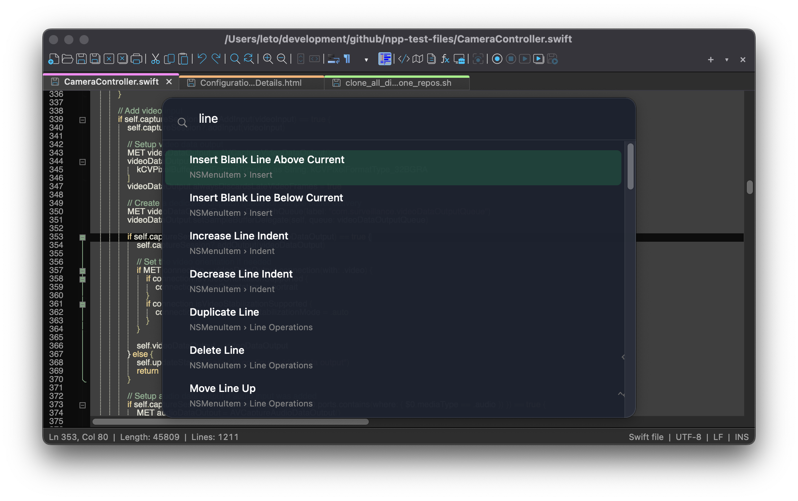

Notepad++ has been one of the most popular source code editors on Windows for almost two decades, with close to 500 million downloads, it's loved by developers for its speed, simplicity, and extensive language support. I always wanted to have the same simple yet powerful editor on my Mac. For 4 months now, I have been using multiagent AI workflows and in mid-March 2026 I decided to take on the task of porting Notepad++ to macOS as a native application. The macOS version retains most that made the original great, which is syntax highlighting for 80+ programming languages, powerful regex-based search and replace, split view editing, macro recording, and a plugin ecosystem. I think that gradually it will be feeling right at home on the Mac. It runs on macOS 11 and later, launches instantly on Intel and M-series chips.

There are a quite a few quirks to iron out. Panels are still not dockable. There are not as many preferences compared to the Windows version. But there are a few cool things like SHIFT+COMMAND+P which opens spotlight search in Notepad++ macOS version. I also added several languages to Notepad++ localization bringing it up to 137 from 94.   

Under the hood, Notepad++ for macOS is written in Objective-C++ using platform-native APIs and the [Scintilla](https://www.scintilla.org/) editing component, the same engine that powers the Windows version. This ensures high performance and a small footprint without relying on emulation layers or Electron wrappers. The project is open source under the [GNU General Public License](https://www.gnu.org/licenses/gpl-3.0.html), and plugin migration from the Windows ecosystem is ongoing. The editor also ships with support for 137 interface languages out of the box. You can download it and learn more at [notepad-plus-plus-mac.org](https://notepad-plus-plus-mac.org).

 

